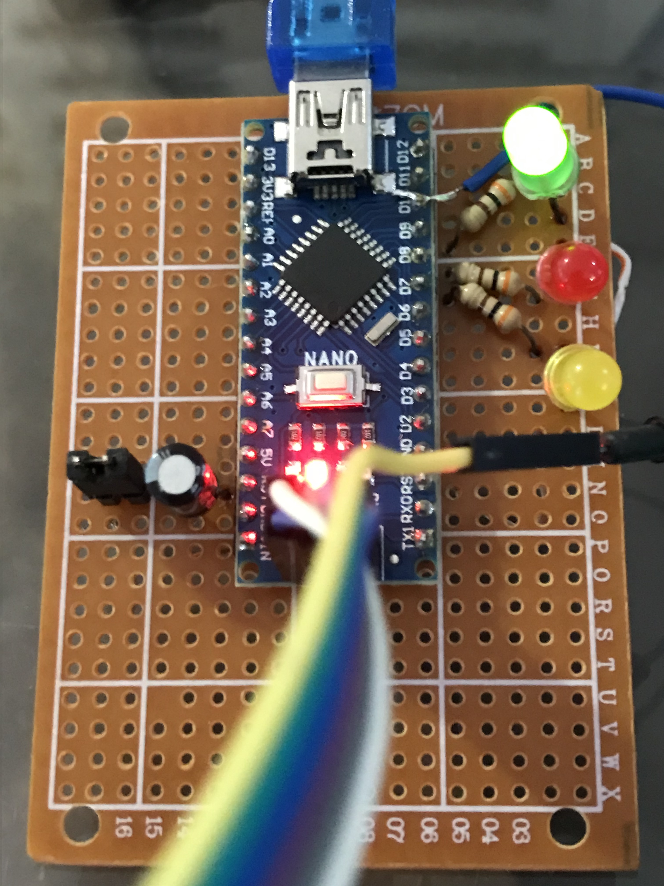

# Arduino nano as ISP

I always had problems flashing to AVR microcontrollers in my projects. Instead of exposing the serial pins for programming the chip using a FTDI or similar programmer, I expose the ICSP pins. The reason for that is because I want to burn bootloader in case I buy a microcontroller chip without it. 

So I needed to buy an AVR programmer, such as AVRISP or AVRISPv2. However, they are very expensive for just programming (maybe it is worth it for debugging purposes), this is why I have always used another Arduino board as ISP programmer. 

But, my projects became very regular and I had a necessity to have a more robust and reliable programmer, without the usage of protoboard and hundreds of faulty cables that made me pluck all my hair of angry.

As you probably know, instead of buying a programmer, as a maker, I just modified an arduino nano to be my programmer. Thus, in this repository I have pushed all files necessary to use an arduino nano as programmer.

In the future, I will design a printed circuit board. For a while, we have it soldered in a prototype board, as can be seen below:

The wiring is explained in the section below.
The LED colors are:
- Green: Heartbeat, as a heart it stays beating to say that the programmer is alive!
- Red: Error! It stays on when the attempt to program fails.
- Yellow: Programming. It stays blinking when it is flashing the program.

**Note**: To flash the ArduinoISP code into the programmer please remove the jumper.

 More info [here](https://www.arduino.cc/en/tutorial/arduinoISP).

_____________

## Flash the ArduinoISP code to the programmer
In the future I will create a make file. For now:

- Clone this repo: `git clone ...`
- `cd` to [build](build/) folder.
- Flash it using avrdude: `avrdude -v -patmega328p -Cavrdude.conf -carduino -b57600 -D -P"/dev/cu.*" -Uflash:w:firmware.hex:i`

**Note**: Remember to remove the jumper.

P.S.: Some boards does not accept some baud rates, accordingly to this [website](https://cache.amobbs.com/bbs_upload782111/files_22/ourdev_508497.html), looks like that the percentage of error is greater in some baud rates while operating in some frequencies. So, if you try to flash using 57600 and an error appears like `avrdude: stk500_recv(): programmer is not responding`, try another baud rate until it flashes correctly.

_____________

## Flash codes to the target microcontroller using nano as ISP
Now that our programmer has the ArduinoISP code, we need to configure it to act as an ISP programmer. In other words, we need ensure that the code that we are trying to flash goes to target board.

Without a knowledge in electronics this is a pain in the ass. Some tutorials on the internet present some wizardry solutions without any explanations. I will try to avoid that.

**========= Long Explanation =========**

First things first. We need to understand what we are doing: **We are using a microcontroller to program another microcontroller**. We know that microcontrollers (in general) does not have USB communication capability. That is why we have an USB-to-Serial chip in every arduino board, which converts USB communication to serial communication (e.g. CH340, FT232RL or even ATMEGA8U2-MU in original Arduino Uno boards).
When booting, the microcontroller has two choices:
  
  1. Run the already flashed code, or;
  2. Enter in flashing mode to receive a new code to run.
  
This choice is made by the bootloader. When the microcontroller boots (after the reset signal provided by the USB-to-Serial chip), it reads some data instructions on the RX/TX, if it receives specific instructions to enter in flashing mode, the microcontroller does so, otherwise, it executes the flashed code.

Now, we need to differentiate this flashing mode to the ISP flashing mode. **It is not the same? No.** 

When flashing using the USB-to-Serial chip we are giving instructions (physically) through the RX/TX pins to the bootloader. These instructions says to enter in flash mode and receive a bunch of hexadecimal values to reprogram the microcontroller. Thus, we are capable to reflash the program itself, but we are not capable to remove or update the bootloader.

On the other hand, when flashing using ISP, we are giving the same instructions, however, through three SPI lines (MISO, MOSI and SCK) according to the standard SPI programming protocol. These pins are reserved for this "more advanced" flashing mode, where we can even update or remove the bootloader.

On both cases, the RESET pin of the target microcontroller is pulled down momentarily to begin sending these instructions.

Now comes the pain in the ass part. When we are using the arduino nano as a programmer, we are sending the hexadecimal values through the USB-to-Serial chip to the nano AVR chip (programmer) to finally send it to the target AVR chip, like this:

Computer USB  ==> USB-to-Serial chip ==> Programmer AVR Chip ==> Target AVR Chip

The problem resides in the fact that when a serial communication starts, the DTR pin of USB-to-Serial chip, which is physically connected to RESET pin of Programmer AVR Chip (see [nano datasheet](https://www.arduino.cc/en/uploads/Main/Arduino_Nano-Rev3.2-SCH.pdf), or [uno datasheet](https://www.arduino.cc/en/uploads/Main/arduino-uno-schematic.pdf)) goes momentarily to LOW, resetting the Programmer AVR Chip.

This is very useful when we want to program the Programmer AVR Chip, however while programming the Target AVR Chip we do not want it. Thus, the solution is to plug a 10uF capacitor between the RESET and GND pins of the Programmer Board.

**========= TLDR =========**

We need to plug a 10uF capacitor between the RESET and GND pins of the Programmer Board.

Then, the RESET pin of the programmer will not be pulled LOW when a communication begins between the Computer USB and USB-to-Serial chip. On other words, DTR pin will not have any effect.

But how the target AVR chip knows that it is necessary to reset? Well, the ArduinoISP code handles that through D10 pin. Which leads to the following wiring:

### Wiring

| Programmer AVR Chip | Target AVR Chip |
| ------------------- | --------------- |
| D12 (MISO)          | D12 (MISO)      |
| D13 (SCK)           | D13 (SCK)       |
| D10                 | RESET           |
| 5V                  | 5V              |
| D11 (MOSI)          | D11 (MOSI)      |
| GND                 | GND             |

Note that in the target, we use exactly the available pins on the ICSP header, just be careful because in some non original Nano boards the header is flipped.
Also, be careful when programming 3.3V only boards. In this case operate the programmer in 3.3V doing an electronic modifications (**try to implement this on the board**).

### Flashing

After doing all the wiring, compile the code you want to upload, take the hexadecimal output file and:

- Flash it using avrdude: `avrdude -v -patmega328p -Cavrdude.conf -cstk500v1 -b19200 -D -P"/dev/cu.*" -Uflash:w:firmware.hex:i`

Still testing, but for now, I was only able to use 19200 as baud rate
